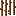
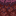

# Image ⇄ JSON Converter
### img2json2img
## A handy tool that let's llms create Minecraft textures from JSON!

Supports single files or entire directories.

This thing is super helpful to create variants of existing blocks and use existing color palettes, just feed the JSON to AI!

# Examples:
## Sakura (Pink) Froglight


## Cocoa Cane (Cocoa Beans + Sugar Cane)


## Cocoa Paper


## Tyrian Nylium (Purple Variant based on Crimson Planks)



## Gold Bars


*Note: The following README was AI Generated
---

## Features

- Modern dark/light UI (CustomTkinter)
- Batch processing
- Multithreaded (no UI freezing)
- Progress bar + status console
- CLI mode + GUI mode
- Optional resizing (16x16, 32x32, 64x64, 128x128)
- Efficient flat pixel array JSON format
- Fully reversible conversions

---

## Installation

### 1. Install Python 3.10+

### 2. Install Dependencies

```bash
pip install pillow customtkinter
```

GUI Usage

Run:

```bash
python main.py
```

Then:

- Select conversion mode

- Choose input file or folder

- Choose output folder

- (Optional) Select resize

- Click Run Conversion

CLI Usage
Image → JSON
```bash
python main.py img2json input_path output_folder
```

With resizing:
```bash
python main.py img2json input_path output_folder 32
```

JSON → Image
```bash
python main.py json2img input_path output_folder
```

JSON Format

Example:
```json
{
  "width": 32,
  "height": 32,
  "pixels": [
    "#ff0000ff",
    "#00ff00ff",
    ...
  ]
}
```

Pixels are stored in row-major order:

index = y * width + x

Performance Notes

Uses getdata() for fast pixel extraction

Uses threading for UI responsiveness

Uses flat pixel array (much smaller than coordinate maps)

Future Upgrade Ideas

Drag & drop support

Palette compression mode

Binary export (.bin)

Sprite sheet builder

Web canvas export

PyInstaller executable packaging

License

MIT
